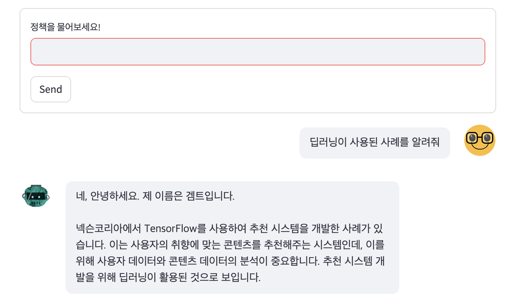

# 넥슨 개발자 컨퍼런스 데이터를 활용한 게임 산업 트렌드 챗봇

## 프로젝트 설명
- 명지대학교 LLM 개발 수업을 듣고, 게임 산업에 관심을 가지고 있었어서, 게임 산업의 트렌드를 설명해주는 챗봇을 개발하였습니다.
- 개발기간 : 2023.12.27 ~ 2023.12.28 
- 개발인원 : 1인
- 사용 파이썬 버전 : 3.10.6

## 시연 이미지

## 코드 설명
1. main.py : 데이터 수집 및 업로드 시 실행
    - 데이터를 수집할 때 사용하는 파일입니다.
    - 데이터 수집 후 summary과정까지 진행할 시, main.py코드를 진행하시면 됩니다.
    1) youtube_crawl : 유튜브 크롤링 코드
        - 해당 코드에서는 Youtube API를 활용하여 데이터를 크롤링합니다.
        - 검색 결과 중, 업로드한 채널이 NDC인 경우만 추가하였습니다.
        - 유튜브 영상의 Title, URL, Year을 데이터프레임 형태로 저장합니다.
    2) script_extract : 자막 추출 저장 코드
        - 수집한 데이터의 URL을 기반으로, 자막을 추출하여 저장합니다.
        - 결과는 Dataset/fulltext 폴더에 저장됩니다
    3) script_summary : 핵심 내용 요약
        - fulltext폴더에서 가져온 내용을 바탕으로 요약 코드를 진행합니다.
        - 결과는 Dataset/summarytext에 저장합니다.
2. robot.py : 챗봇 실행시 실행
    - 사용 방법 : 경로에 입장하여 streamlit run robot.py를 입력하면 웹페이지로 연결됩니다.
    - 프롬프트는 자율적으로 설정 가능합니다.
    - 설정된 프롬프트 내용을 바탕으로 질문을 받으면 답을 주는, 챗봇의 형태입니다.

2. Dataset
    - 데이터를 저장하는 경로입니다.
    1) fulltext
        - script_extract 코드의 실행 결과를 저장한 파일입니다.
        - 파일명은 순서대로 저장했을 뿐, 실제로 이 순서는 뒤에서 변경되고, 챗봇과는 전혀 무관합니다.
    2) summarytext
        - script_summary 코드의 실행 결과를 저장한 파일입니다.
        - fulltext로 진행을 하게 되면, 한계 토큰 초과로 오류가 발생하여, 요약을 진행하였습니다.

## 유의사항
- 경로는 제 컴퓨터를 기준으로 설정했고, M1 환경에서 개발했습니다. 경로를 수정하시고 진행하시는 것을 권장합니다.
- 본 챗봇은 AWS의 Bedrock를 사용해서 구현합니다. 실제로 사용 시, 일정 금액을 사용해야 할 수 있습니다. (해당 챗봇을 개발할 수 있었던 환경은 수업에서 AWS 계정을 지급해주었기 때문입니다.)
- 해당 코드는 https://github.com/ukairia777/aws-bedrock-tutorial 사이트의 코드들을 참조하여 만들었습니다.
- (중요!) 유튜브 영상을 크롤링하는 것에 있어서, 자막이 있는 영상만 사용했습니다. 자막이 없는 영상은 불가능합니다!
- 시현하기 위해, 다음과 같은 AWS 클라우드를 설정해야 합니다.
    - AWS-CLI를 설치해야 합니다.
    - 순서대로 터미널(or cmd)에서 다음의 코드를 입력합니다.
        1. which aws : 경로 파악
        2. aws configure
            - 이후 AWS Access Key ID [None]에는 본인의 Access Key, AWS Secret Access Key [None]에는 본인의 Secret Access Key를 입력해야 합니다.
            - Default region name [None]를 us-west-2로, Default output format [None]를 json으로 설정합니다.
        3. 재부팅 시 해당 과정을 다시 수행해야 합니다.